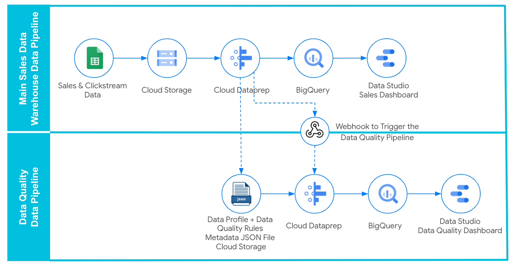

# Demo Data Quality Monitoring For Cloud Dataprep Pipelines

Assets for demonstration of the blog post **"Setting Up Data Quality Monitoring For Cloud Dataprep Pipelines"(https://www.trifacta.com/blog/xxxxxxxx/)**

- **[flow_Profiling  Quality Rules Processing.zip](https://github.com/victorcouste/trifacta-flows-examples/blob/main/Profiling%20%20Quality%20Rules%20Processing/flow_Profiling%20%20Quality%20Rules%20Processing.zip)** : The DQ Dataprep Flow that extracts the Profiling and Data Quality results and loads them into BigQuery tables.

- **[flow_Data%20Quality_Clickstream_and_Sales.zip](https://github.com/victorcouste/trifacta-flows-examples/blob/main/Profiling%20%20Quality%20Rules%20Processing/flow_Data%20Quality_Clickstream_and_Sales.zip)** : The Sales DWH Dataprep Flow example used in this blog. If you wish, you can use your own Cloud Dataprep flow for which you want to monitor the Data Quality for.

- **[Sales_Data_small.csv](https://github.com/victorcouste/trifacta-flows-examples/blob/main/Profiling%20%20Quality%20Rules%20Processing/Sales_Data_small.csv)** : Sales CSV file used as one of inputs of the DW flow example.

- **[Advertising_Clickstream.csv](https://github.com/victorcouste/trifacta-flows-examples/blob/main/Profiling%20%20Quality%20Rules%20Processing/Advertising_Clickstream.csv)** : Clickstream CSV file used as one of inputs of the DW flow example.

You can make your own copy of the Data Studio dashboard **[[PUBLIC] Cloud Dataprep Profiling & Data Quality Dashboard](https://www.google.com/url?q=https://datastudio.google.com/reporting/3ed00013-d755-4010-8b00-58da2c69ea81&sa=D&ust=1608540809439000&usg=AOvVaw1t6oJQ4ZkvX05IATmEzulr
)** to customize it to your Data Quality monitoring needs.

Google Cloud Dataprep by Trifacta https://cloud.google.com/dataprep

Google Cloud Dataprep API https://clouddataprep.com/documentation/api

All Trifacta API https://api.trifacta.com/
